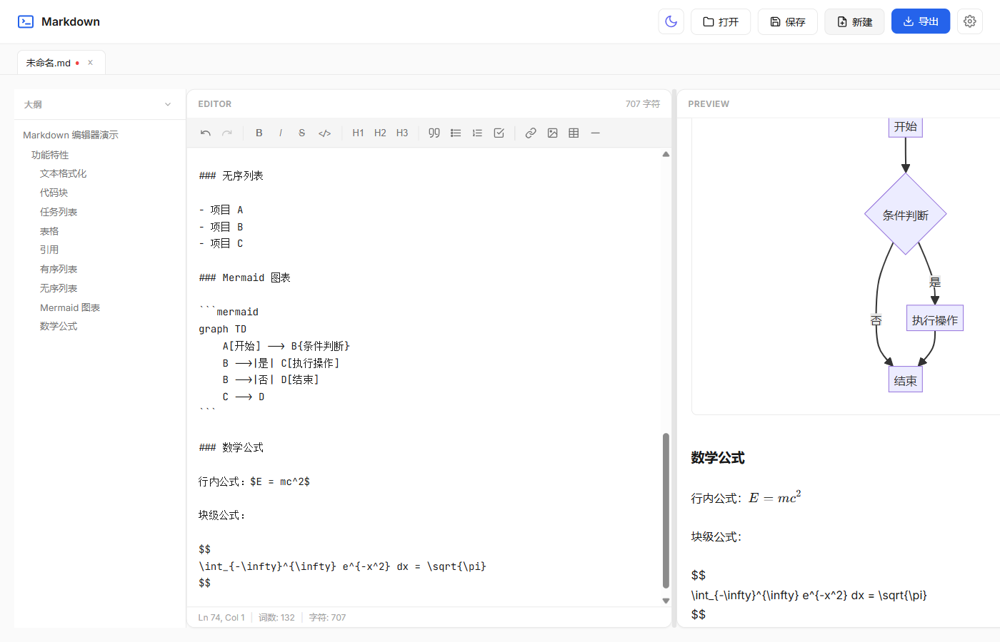
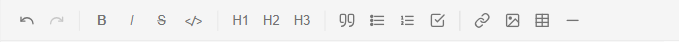
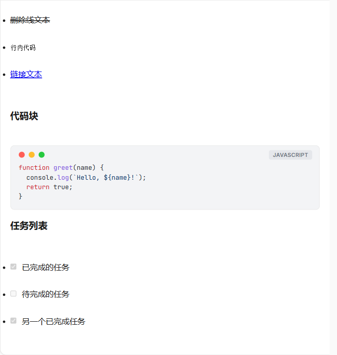
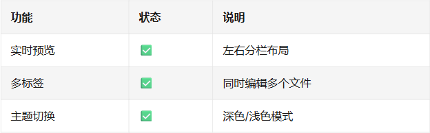
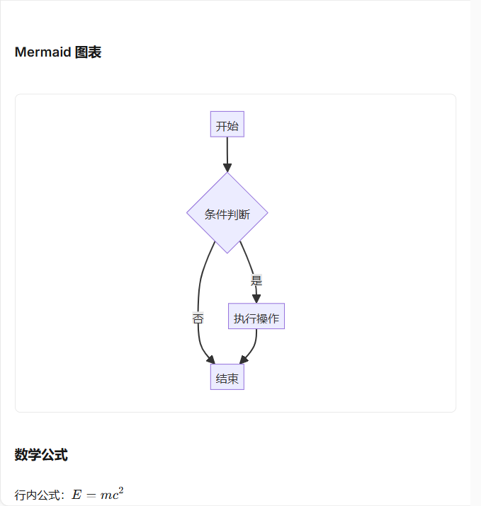
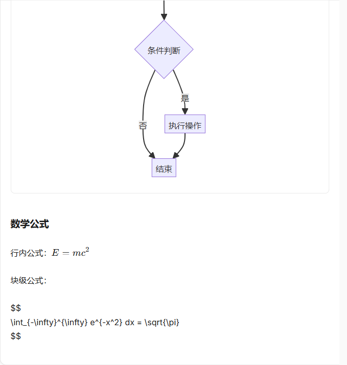
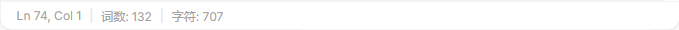
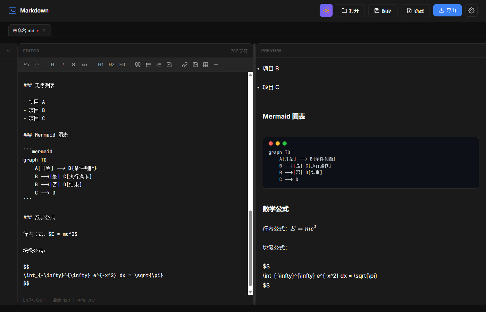

# 功能介绍
## 整体界面   

编辑器采用左右分栏布局，左侧为 Markdown 源码编辑区，右侧为实时预览区。顶部工具栏提供常用格式化按钮，底部状态栏显示行列号、字符数等信息。

## 工具栏

工具栏支持快捷插入：粗体、斜体、删除线、行内代码、链接、图片、各级标题、引用、有序/无序列表、任务列表、表格、分割线等格式化元素。

## 代码块高亮

基于 highlight.js 实现语法高亮，支持多种编程语言。预览区代码块采用 macOS 风格窗口装饰，右上角显示语言标签。

## 任务列表

支持 `- [ ]` / `- [x]` 语法的任务列表，预览区可直接点击复选框切换完成状态。

## 表格

支持 GFM（GitHub Flavored Markdown）表格语法，预览区自动渲染为格式化表格，带斑马纹样式。

## Mermaid 图表

支持 Mermaid 语法，可渲染流程图、时序图、甘特图、类图、饼图、状态图、ER 图、Git 图等多种图表类型。

## 数学公式

通过 KaTeX 渲染数学公式，支持 `$...$` 行内公式和 `$$...$$` 块级公式。

## 状态栏

底部状态栏实时显示：光标所在行号、列号、字符数、词数、选中字符数。

## 深色主题

一键切换深色/浅色主题，Mermaid 图表和代码高亮会根据主题自动适配，偏好设置自动持久化。
