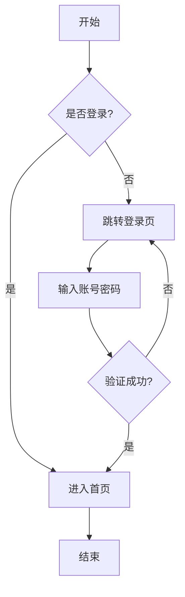
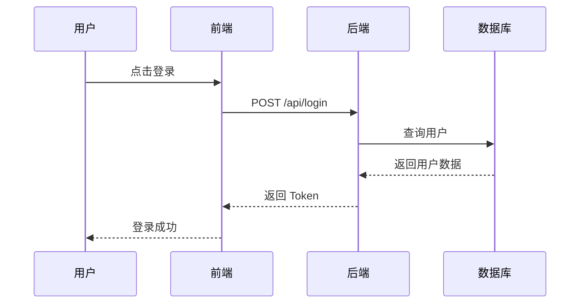
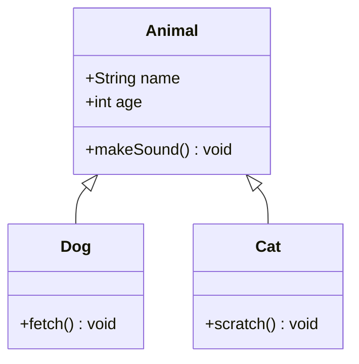
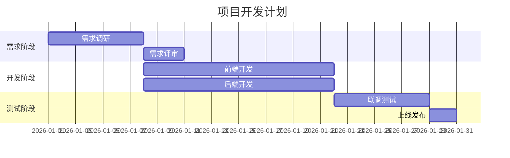
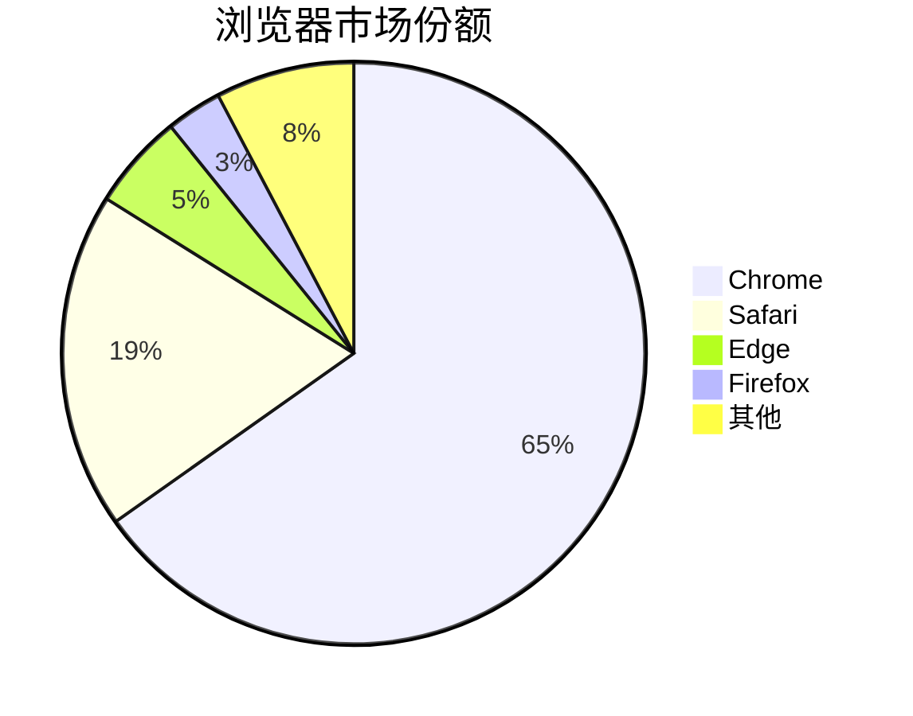
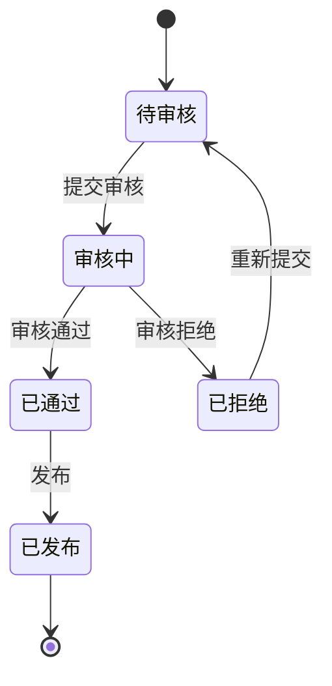
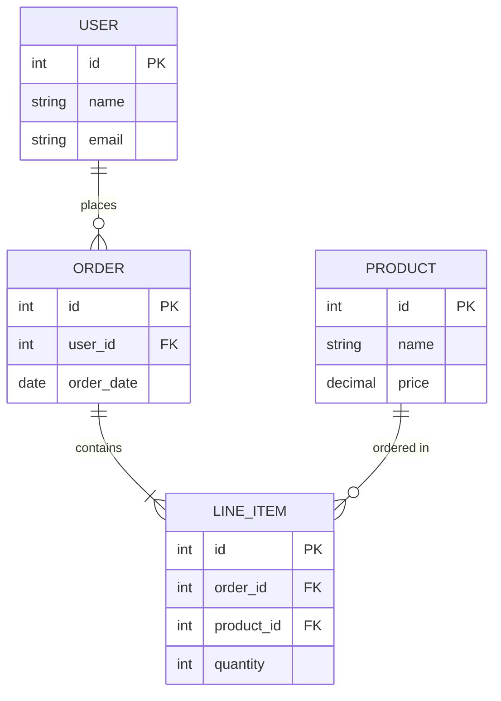
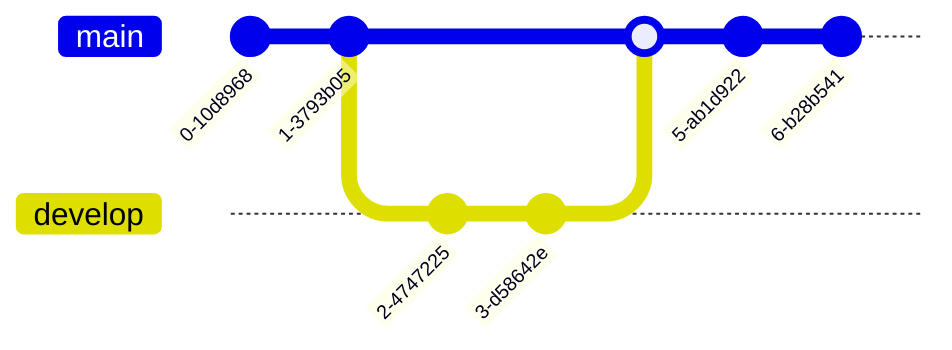

# Mermaid 图表渲染测试

## 1. 流程图（Flowchart）

## 2. 时序图（Sequence Diagram）

## 3. 类图（Class Diagram）

## 4. 甘特图（Gantt）

## 5. 饼图（Pie）

## 6. 状态图（State Diagram）

## 7. ER 图（Entity Relationship）

## 8. Git 图（Git Graph）

